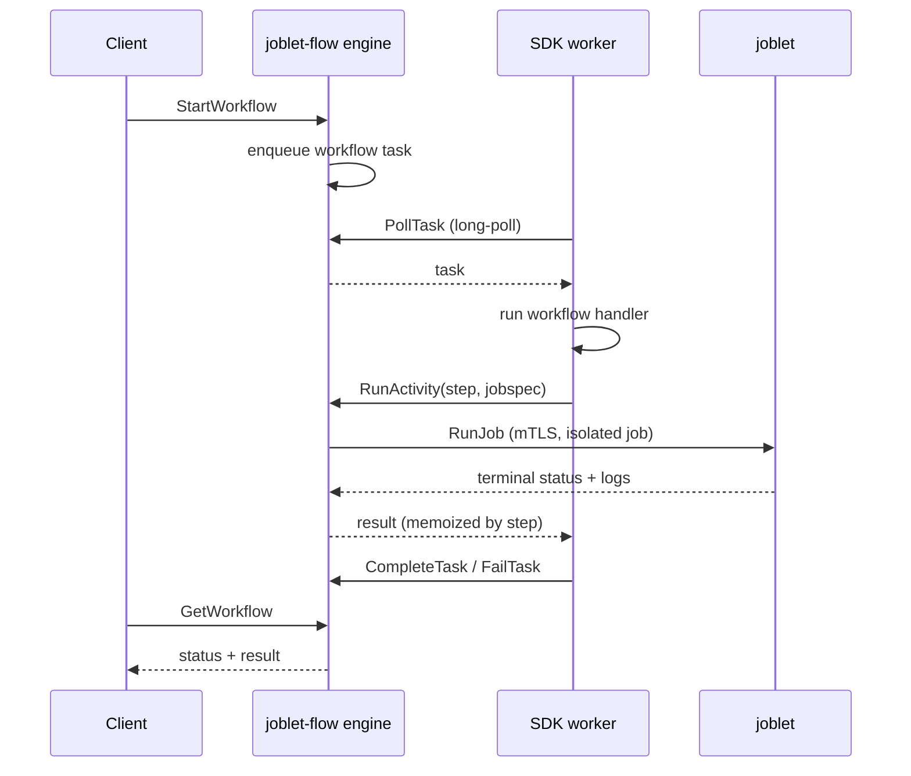

# joblet-flow

The **joblet-flow engine** - a language-agnostic workflow orchestrator.
It owns control flow; SDK workers (`joblet-flow-sdk-python`, `-node`, …) run the
actual workflow and activity code. An **activity can run as an isolated joblet
job**: the engine dispatches it through joblet's `JobService` and records its
result.

The gRPC contract is [`joblet-proto/proto/flow/flow.proto`](../joblet-proto/proto/flow/flow.proto)
(`FlowService`). Every SDK generates its client from that file.

📖 **Docs:** [Architecture / system design](docs/ARCHITECTURE.md) ·
[Protocol reference](docs/PROTOCOL.md) · [Configuration](docs/CONFIGURATION.md) ·
[Development](docs/DEVELOPMENT.md) · [Compatibility](COMPATIBILITY.md)

## What the engine does (and doesn't)

**Owns - logic and orchestration only:**
- Workflow state keyed by `workflow_id` (behind a pluggable `Store`)
- Task queues that workers long-poll (`PollTask`)
- Dispatch of job activities as joblet jobs (`RunActivity` → joblet `RunJob`,
  wait for terminal status, capture logs)
- Step-indexed memoization of activity + side-effect results → deterministic
  replay and idempotency
- Retry policy, signals, `workflow_id` idempotency

**Never touches:**
- Workflow / activity handler code - that runs in the SDK worker
- Serialization - all inputs, results, and side-effect payloads are opaque
  `bytes`; SDKs agree on a codec (JSON for v1)
- Any language toolchain

## Architecture



## FlowService RPCs

| RPC | Caller | Purpose |
|-----|--------|---------|
| `StartWorkflow` | client | begin a run (idempotent on `workflow_id`) |
| `GetWorkflow` | client | read status / result |
| `SignalWorkflow` | client | deliver an external signal |
| `PollTask` | worker | long-poll for the next task |
| `CompleteTask` / `FailTask` | worker | report the run's terminal result |
| `RunActivity` | handler | run an activity as a joblet job, memoized by `step` |
| `RunWorkerActivity` | handler | run a named activity on a worker, memoized by `step` |
| `CompleteActivity` / `FailActivity` | activity worker | report a worker activity's outcome |
| `WaitSignal` | handler | block for a named signal, memoized by `step` |
| `GetSideEffect` / `RecordSideEffect` | handler | durable non-deterministic steps |

## Install

joblet-flow ships as its own `.deb`/`.rpm` (amd64 and arm64) with home
`/opt/joblet-flow` and a systemd unit. It requires a joblet install on the same
host: the unit reads mTLS credentials from the joblet install and listens on
loopback only (`127.0.0.1:50055`), since `FlowService` has no authentication.
The package declares no dpkg dependency on joblet; with joblet absent, the
service simply fails to start.

```bash
./scripts/build-deb.sh            # -> joblet-flow_<version>_<arch>.deb
sudo dpkg -i joblet-flow_*.deb    # installs, enables, and starts the service
systemctl status joblet-flow
```

See [CONFIGURATION](docs/CONFIGURATION.md) for the installed service and how the
engine connects to joblet.

## Build & test

```bash
make build     # -> bin/joblet-flow
make test      # unit tests (no live joblet needed)
make pre-pr    # unit tests + clean-room e2e, structurally identical to joblet's
```

The e2e suite is a clean-room validation (uninstalls flow and joblet, installs
the latest released joblet, installs flow from the tree, runs every suite
against the installed service). Details, make targets, and the layout are in
[DEVELOPMENT](docs/DEVELOPMENT.md).

## Clients

There is no separate CLI for joblet-flow - applications use the language SDKs
([`joblet-flow-sdk-python`](../joblet-flow-sdk-python),
[`joblet-flow-sdk-node`](../joblet-flow-sdk-node)), and the operator surface is
designed as an `rnx flow` command group ([docs/RNX_FLOW_CLI.md](docs/RNX_FLOW_CLI.md)).

## Status

The full `FlowService` runs over an in-memory authoritative `Store`. With
`FLOW_STORE_SOCKET` set, mutations are also persisted to disk by the supervised
`flow-store` subprocess (an event log), keeping flow-core free of storage
dependencies. Recovery on restart (replaying that log) is the next step. See
[ARCHITECTURE](docs/ARCHITECTURE.md) for the design, complete limitations
table, and roadmap.
