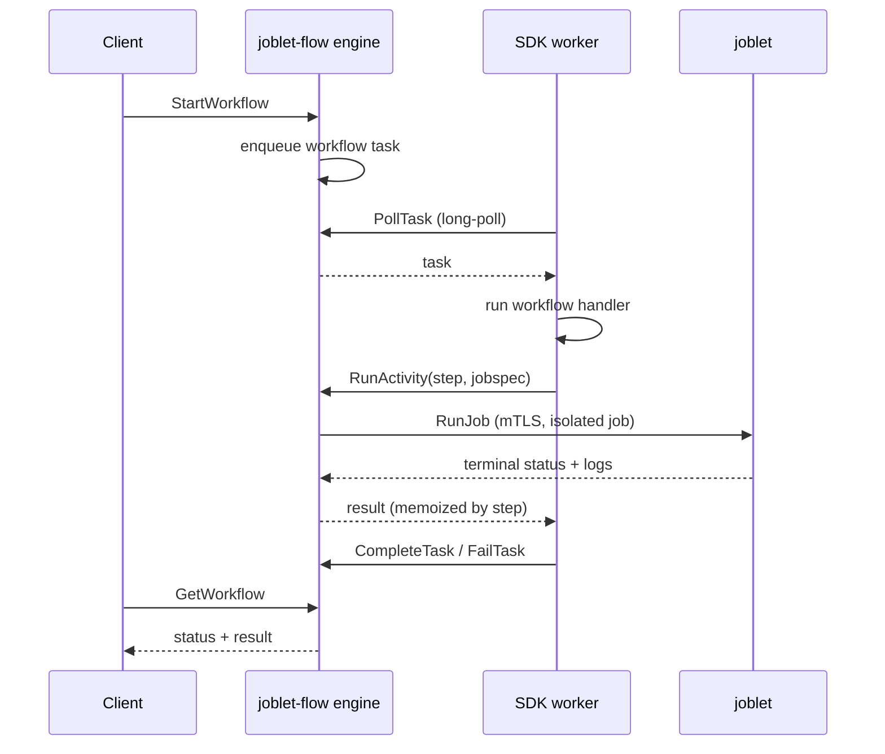

# joblet-flow

The **joblet-flow engine** - a language-agnostic workflow orchestrator.
It owns control flow; SDK workers (`joblet-flow-sdk-python`, `-node`, …) run the
actual workflow and activity code. An **activity can run as an isolated joblet
job**: the engine dispatches it through joblet's `JobService` and records its
result.

The gRPC contract is [`joblet-proto/proto/flow/flow.proto`](../joblet-proto/proto/flow/flow.proto)
(`FlowService`). Every SDK generates its client from that file.

📖 **Docs:** [Architecture / system design](docs/ARCHITECTURE.md) ·
[Protocol reference](docs/PROTOCOL.md) · [Configuration](docs/CONFIGURATION.md) ·
[Development](docs/DEVELOPMENT.md) · [Compatibility](COMPATIBILITY.md)

## What the engine does (and doesn't)

**Owns - logic and orchestration only:**
- Workflow state keyed by `workflow_id` (behind a pluggable `Store`)
- Task queues that workers long-poll (`PollTask`)
- Dispatch of job activities as joblet jobs (`RunActivity` → joblet `RunJob`,
  wait for terminal status, capture logs)
- Step-indexed memoization of activity + side-effect results → deterministic
  replay and idempotency
- Retry policy, signals, `workflow_id` idempotency

**Never touches:**
- Workflow / activity handler code - that runs in the SDK worker
- Serialization - all inputs, results, and side-effect payloads are opaque
  `bytes`; SDKs agree on a codec (JSON for v1)
- Any language toolchain

## Architecture



## FlowService RPCs

| RPC | Caller | Purpose |
|-----|--------|---------|
| `StartWorkflow` | client | begin a run (idempotent on `workflow_id`) |
| `GetWorkflow` | client | read status / result |
| `SignalWorkflow` | client | deliver an external signal |
| `PollTask` | worker | long-poll for the next task |
| `CompleteTask` / `FailTask` | worker | report the run's terminal result |
| `RunActivity` | handler | run an activity as a joblet job, memoized by `step` |
| `RunWorkerActivity` | handler | run a named activity on a worker, memoized by `step` |
| `CompleteActivity` / `FailActivity` | activity worker | report a worker activity's outcome |
| `WaitSignal` | handler | block for a named signal, memoized by `step` |
| `GetSideEffect` / `RecordSideEffect` | handler | durable non-deterministic steps |

## Layout

```
cmd/joblet-flow        entrypoint: config, joblet dial, gRPC server
internal/engine        FlowService implementation, Store interface, in-memory store
internal/jobletclient  activity job runner over joblet's JobService
internal/config        environment configuration
debian/, scripts/      .deb packaging, systemd unit, e2e helpers
tests/e2e              clean-room e2e suite and its test driver
.github/workflows      CI and the tag-triggered release
```

## Install

joblet-flow ships as its own `.deb` with home `/opt/joblet-flow` and a systemd
unit. It requires a joblet install on the same host: the unit reads mTLS
credentials from `/opt/joblet/config/rnx-config.yml` and listens on loopback
only (`127.0.0.1:50055`), since `FlowService` itself has no authentication.

```bash
./scripts/build-deb.sh            # -> joblet-flow_<version>_<arch>.deb
sudo dpkg -i joblet-flow_*.deb    # installs, enables, and starts the service
systemctl status joblet-flow
```

RPM packages (`./scripts/build-rpm.sh`, needs `rpmbuild`) are built for both
architectures too; releases publish `.deb` and `.rpm` for amd64 and arm64.

The package declares no dpkg dependency on joblet: joblet installs, runs, and
uninstalls without regard to joblet-flow. With joblet absent, the flow service
fails to start until joblet is installed again.

## Build & run

```bash
make test         # unit tests, cache disabled (no live joblet needed)
make build        # -> bin/joblet-flow
make deb          # -> joblet-flow_<version>_<arch>.deb
make e2e          # clean-room e2e (needs sudo, see below)
make pre-pr       # unit tests + e2e, structurally identical to joblet's

# mTLS to joblet (default): reads a node from rnx-config.yml
FLOW_LISTEN_ADDR=:50055 JOBLET_CONFIG=~/.rnx/rnx-config.yml make run

# insecure to joblet (dev only)
JOBLET_INSECURE=1 JOBLET_ADDR=localhost:50051 make run
```

### Connecting to joblet

The engine dials joblet over **mTLS by default**, loading a node's embedded
`cert`/`key`/`ca` from an `rnx-config.yml` (the same file rnx uses), with
`ServerName: joblet` and TLS 1.3.

| Env | Default | Purpose |
|-----|---------|---------|
| `FLOW_LISTEN_ADDR` | `:50055` | FlowService listen address |
| `JOBLET_CONFIG` | *(standard search paths)* | explicit `rnx-config.yml` |
| `JOBLET_NODE` | *(isDefault node)* | node entry to dial; empty uses the node marked `isDefault: true` |
| `JOBLET_INSECURE` | *(off)* | `1` = plaintext dial (dev only), uses `JOBLET_ADDR` |
| `JOBLET_ADDR` | `localhost:50051` | target in insecure mode |

## Clients & end-to-end tests

There is no separate CLI for joblet-flow - applications use the language SDKs
([`joblet-flow-sdk-python`](../joblet-flow-sdk-python),
[`joblet-flow-sdk-node`](../joblet-flow-sdk-node)), and the operator surface is
designed as an `rnx flow` command group ([docs/RNX_FLOW_CLI.md](docs/RNX_FLOW_CLI.md)).

The e2e suite (`tests/e2e/run_tests.sh`, run by `make pre-pr`) is a clean-room
validation on this host: it uninstalls joblet-flow AND joblet completely,
installs the latest released joblet from GitHub, installs joblet-flow from the
working tree as a `.deb`, and runs every suite fail-fast against the installed
service. Suites drive a test-only driver over the `FlowService` contract and
cross-check activity jobs from joblet's side via rnx:

- `01_lifecycle` - start, poll, complete/fail, `workflow_id` idempotency,
  NotFound for unknown ids
- `02_activity` - activities run as real joblet jobs (confirmed by rnx), step
  replay is memoized, a retried failure produces exactly two attempts
- `03_signal` - buffered delivery, live delivery to a blocked waiter, memoized
  wait replay

## Status

The full `FlowService` is implemented over an **in-memory** `Store`, so state
does not survive an engine restart; a durable store slots in behind the
existing `Store` interface (see [ARCHITECTURE](docs/ARCHITECTURE.md) for the
complete limitations table and roadmap). All RPCs, step memoization, retry,
long-poll, signals, and mTLS activity dispatch to a real joblet are verified by
the e2e suite on every pre-pr run.
