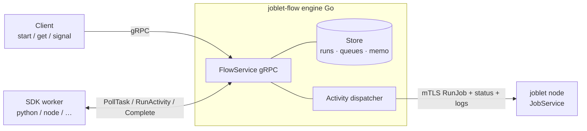
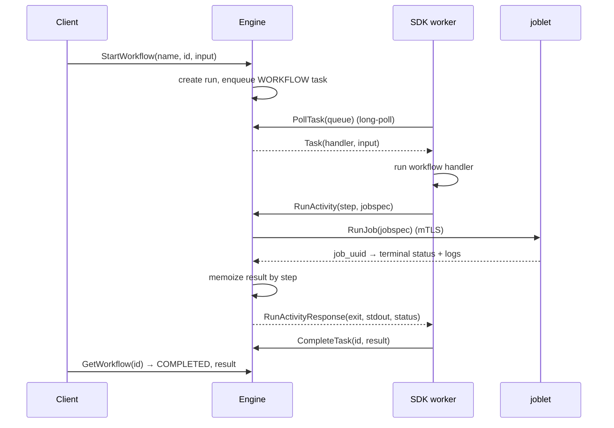
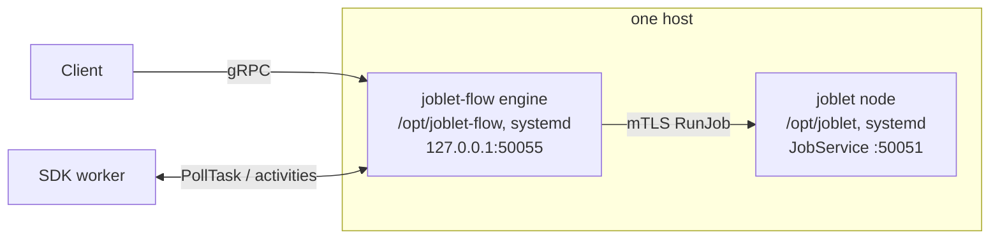
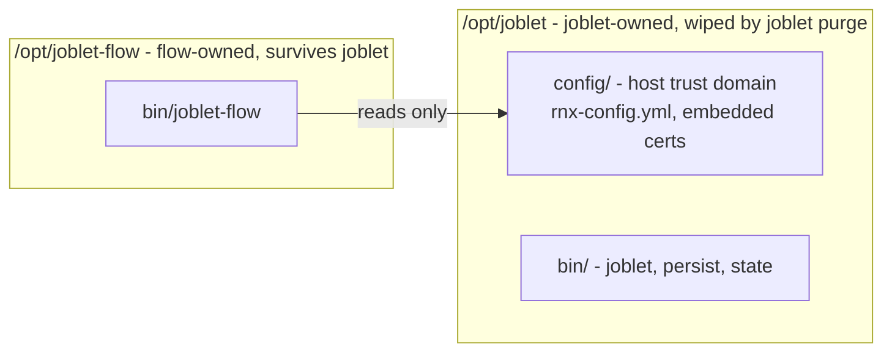

# joblet-flow - System Design

joblet-flow is a **language-agnostic durable workflow engine** - durable
execution for agentic AI (a Temporal-style engine). It owns control flow -
workflow state, task queues, retries, deterministic replay - while the actual
workflow logic runs in language SDK workers. Its distinguishing trait: an
activity can run as an **isolated [joblet](https://github.com/ehsaniara/joblet)
job**, so agent-invoked tools and LLM-generated code execute sandboxed
(namespaces, cgroups, GPU) - something worker-only engines cannot offer.

- [Goals & non-goals](#goals--non-goals)
- [Components](#components)
- [What the engine owns (and never touches)](#what-the-engine-owns-and-never-touches)
- [Workflow lifecycle](#workflow-lifecycle)
- [Execution model: loops, DAGs, and cycles](#execution-model-loops-dags-and-cycles)
- [Determinism & replay](#determinism--replay)
- [Task queues & long-poll](#task-queues--long-poll)
- [Activity dispatch to joblet](#activity-dispatch-to-joblet)
- [Retry & backoff](#retry--backoff)
- [State store](#state-store)
- [Security](#security)
- [Deployment topology](#deployment-topology)
- [Failure modes & limitations](#failure-modes--limitations)
- [Roadmap](#roadmap)

## Goals & non-goals

**Goals**

- Durable, resumable orchestration of multi-step work.
- Run each step as an isolated joblet job (namespaces, cgroups, optional GPU).
- Be language-agnostic: the engine holds no user code and no serialization
  format - every payload is opaque bytes.
- Support durable AI/agent workflows: non-deterministic steps (e.g. an LLM call)
  are recorded once and replayed from history.

**Non-goals**

- The engine does not execute workflow or activity code.
- The engine does not define a serialization format (SDKs agree on JSON).
- The engine is not a general job scheduler - joblet is.

## Components



| Component       | Role                                                                                             |
|-----------------|--------------------------------------------------------------------------------------------------|
| **Client**      | Starts workflows, reads status/results, sends signals.                                           |
| **Engine**      | Serves `FlowService`; owns durable state and control flow; dispatches activities as joblet jobs. |
| **SDK worker**  | Long-polls for workflow tasks, runs the handler, reports results. Holds all user code.           |
| **joblet node** | Runs each activity as an isolated job. The engine is a joblet *client*.                          |

The engine depends only on `joblet-proto` (for both the `FlowService` server and
the `JobService` client) - not on joblet's server module.

## What the engine owns (and never touches)

**Owns - logic and orchestration only**

- Workflow lifecycle & durable state keyed by `workflow_id`
- Task queues + long-poll dispatch
- Activity dispatch → joblet `RunJob`, wait terminal, capture logs
- Step-indexed memoization (activities + side effects) → replay & idempotency
- Retry policy, signals, `workflow_id` idempotency

**Never touches**

- Workflow / activity handler code (lives in the SDK worker)
- Serialization format (SDK concern; JSON in v1) - payloads are opaque `bytes`
- Any language runtime

## Workflow lifecycle



The workflow handler runs entirely on the worker; each durable operation it
performs is a synchronous call back to the engine.

## Execution model: loops, DAGs, and cycles

joblet-flow is **code-first, not a static DAG**. There is no declared graph of
nodes and edges (as in Airflow/Argo); the graph is *implicit* in the workflow
handler's control flow.

- **Dependencies** are expressed by ordinary sequencing: `run_activity` blocks
  and returns a result, and the next call uses it. "B after A" is just two lines.
- **Branches** are `if`/`match` in the handler.
- **Loops** are native `for`/`while` in the handler. Each iteration issues new
  steps (0, 1, 2, …); the engine never models the loop, it just memoizes each
  step. A bounded loop is a bounded, resumable sequence of activities.
- **Fan-out / parallelism** - v1 issues activities sequentially; the SDKs
  expose no concurrent-activity API (see [roadmap](#roadmap)).

**Where the loops live.** The engine runs *no* per-workflow loop - it is pure
request/response. The only driving loop is the **worker's poll loop**
(`PollTask` → run handler → `CompleteTask`). Iteration inside a workflow is just
the handler's own loop, running on the worker.

**Why there is no cycle detection (in the DAG sense).** With no static graph,
there are no graph cycles to reject at submit time. Ordering is determined by
execution, not a pre-declared edge set, so the classic "reject a DAG that
contains a cycle" check does not apply here.

**The real concern is a runaway workflow** - e.g. `while True: run_activity(...)`

- which dispatches jobs and grows history without bound. This is the
  imperative-model analog of a cycle, and the engine enforces **no guardrails**
  against it: there is no max-step cap and no workflow-level timeout (see
  [limitations](#failure-modes--limitations) and the [roadmap](#roadmap)).
  Workflow authors own termination (bounded loops, explicit exit conditions).
  Per-activity **retry** is separately bounded by `RetryPolicy.max_attempts`,
  so a single flaky step can never loop forever.

## Determinism & replay

The model is **memoization by step ordinal**, simpler than full event-sourcing:

- The worker assigns each durable operation a deterministic `step` (0, 1, 2, …
  in call order - the SDK's `WorkflowContext` does this automatically).
- `RunActivity(step)` and `GetSideEffect(step)` are memoized by
  `(workflow_id, step)`. On a re-run of the handler, the same step returns the
  recorded value instead of dispatching a job or re-executing a side effect.
- This keeps the engine language-agnostic: it needs only **stable step ordinals
    + opaque bytes**. The SDK contract is: *same handler → same step sequence*.

Side effects (`GetSideEffect`/`RecordSideEffect`) exist for non-deterministic
work - an LLM response, a random id, a timestamp - so replays are stable. The
engine stores the bytes opaquely and is provider/model agnostic.

## Task queues & long-poll

- `StartWorkflow` enqueues a `WORKFLOW` task onto a queue (`default` in v1).
- Workers `PollTask(queue)` with a **long poll**: the engine blocks until a task
  is available or the request deadline approaches.
- To avoid racing the client's deadline, the engine returns `available=false`
  ~`pollDeadlineMargin` (250 ms) **before** the caller's deadline, so an empty
  poll is always a clean response rather than a `DeadlineExceeded` error.

## Two kinds of activity

A workflow reaches the outside world through activities, of which there are two:

- **Job activity** (`RunActivity`) - runs as an **isolated joblet job**. Use for
  tools and code that must be sandboxed (agent-invoked commands, generated code).
  The engine runs the job and returns its result. This is the differentiator.
- **Worker activity** (`RunWorkerActivity`) - runs as a **registered function on
  an activity worker**. Use for lightweight worker-side work (LLM calls, simple
  tools). The engine enqueues an activity task, an activity worker executes it
  and reports via `CompleteActivity`/`FailActivity`, and the engine retries and
  memoizes. This is the Temporal-style activity, essential for the agent loop:

  ```python
  while not done:
      decision = ctx.run_worker_activity("llm_decide", state)   # LLM call
      result   = ctx.run_activity("run_tool", command=decision.tool)  # sandboxed
      state, done = update(state, decision, result)
  ```

Both are memoized by `step`, so a replay returns recorded results instead of
re-running the LLM or re-dispatching a job.

## Activity dispatch to joblet

A job activity is a `FlowJobSpec`. The engine maps it to a joblet `RunJobRequest`,
submits it, polls to a terminal status, and captures logs.

| FlowJobSpec                                  | RunJobRequest                                      |
|----------------------------------------------|----------------------------------------------------|
| `runtime`, `command`, `args`, `env`          | same                                               |
| `resources.max_cpu / max_memory / gpu_count` | `max_cpu / max_memory / gpu_count`                 |
| `node`                                       | *(ignored - the job runs on the connected joblet)* |

**Terminal statuses**: `COMPLETED` (success), `FAILED`, `STOPPED`, `TIMEOUT`
(failures). Logs come from joblet's combined stream and are returned as
`stdout`; `stderr` is currently empty.

## Retry & backoff

`RunActivity` accepts an optional `RetryPolicy`. The engine re-dispatches the job
on a non-`COMPLETED` outcome up to `max_attempts`:

- `backoff: "exponential"` (default) → `base_ms * 2^(attempt-1)` (shift capped)
- `backoff: "fixed"` → `base_ms`

A job that runs but ends non-`COMPLETED` after exhausting retries is returned
as-is (the worker sees the terminal status); only a transport failure with no
response surfaces as a gRPC error.

## State store

All engine state sits behind a `Store` interface: workflow runs, task queues,
and the activity/side-effect memo. The current implementation is **in-memory**
(`memStore`) - state is lost on restart. A durable store (SQLite/Bolt) drops in
behind the same interface with no engine changes; that is the main gap between
the current skeleton and a production engine.

## Security

**Trust domain.** joblet and joblet-flow share one root CA per host. The
joblet cert ceremony provisions the whole trust domain: server leaves for
joblet (`ServerName: joblet`) and for flow (`ServerName: joblet-flow`,
loopback-only SANs, written to `/opt/joblet/config/joblet-flow-server.yml`),
plus role client certs (admin/maintainer/developer/reader) used by rnx,
admin-ui, the SDKs, and the engine itself. Containment: the flow server cert
carries no `joblet` SAN so it cannot impersonate joblet, and server leaves are
`serverAuth`-only so they fail client authentication. The root key does not
survive the ceremony; no signing keys persist on the host.

**Engine → joblet.** The engine dials joblet over **mTLS** by default, loading
a node's embedded `cert`/`key`/`ca` from an `rnx-config.yml` (the same file
rnx uses), with `ServerName: joblet` and TLS 1.3. A development `insecure`
mode dials plaintext. See [CONFIGURATION.md](CONFIGURATION.md).

**SDK/client → engine.** Plaintext gRPC on loopback only; `FlowService`
performs no authentication, and the loopback listener is the access boundary.
Serving TLS with the provisioned flow server cert and verifying role client
certs (client-plane vs worker-plane authorization) is on the
[roadmap](#roadmap) and is required before any worker runs off-host.

## Deployment topology



- Engine: installed from its own `.deb` with home `/opt/joblet-flow` and a
  systemd unit; the unit listens on loopback only (`FlowService` has no
  authentication) and reads mTLS credentials from the joblet install.
- Workers: one or more, scale by running more processes polling the queue.
- joblet: one node, on the same host; `FlowJobSpec.node` is ignored (see
  [roadmap](#roadmap) for multi-node routing).

### Install layout: separate homes

joblet-flow and joblet keep **separate homes** with a one-way shared surface:



- Each package owns exactly one tree. joblet's uninstall removes `/opt/joblet`
  and verifies no residue; it never touches `/opt/joblet-flow`, and flow's
  uninstall never touches `/opt/joblet`. Neither package declares a dpkg
  dependency on the other.
- The shared surface is read-only: flow reads the joblet install's client
  configuration for mTLS credentials and writes nothing into joblet's home.
- Anything flow must keep across joblet reinstalls (its binary, and a durable
  store once one exists) lives under `/opt/joblet-flow`. joblet purges and
  reinstalls freely, including several times per e2e run, without affecting it.
- Shared home and shared lifecycle go together: `persist` and `state` live in
  `/opt/joblet/bin` because they are subprocesses of joblet-core, in joblet's
  package. flow releases independently, so it lives in its own home, the same
  way rnx installs outside `/opt/joblet`.

## Failure modes & limitations

| Area              | Current behavior                                                                                                                               |
|-------------------|------------------------------------------------------------------------------------------------------------------------------------------------|
| Engine restart    | In-memory state is lost (no durable store yet).                                                                                                |
| Task delivery     | At-most-once: a task can be dropped if a worker's poll is cancelled exactly as the task is handed out (needs lease/ack).                       |
| Signals           | Delivered into a running workflow via `WaitSignal` (buffered if early). Buffers are in-memory, lost on restart.                               |
| Runaway workflows | No max-step / history cap or workflow-level timeout yet; an unbounded loop dispatches jobs without bound. Authors own termination.             |
| Multi-node        | `FlowJobSpec.node` ignored; activities run on the connected joblet.                                                                            |
| Activity streams  | `stdout` only (joblet combines streams); `stderr` empty.                                                                                       |
| SDK ↔ engine      | Plaintext gRPC (no auth).                                                                                                                      |

## Roadmap

Toward a full durable-execution engine for agentic AI:

1. ✅ **Worker activities** - Temporal-style activities for LLM calls / tools.
2. ✅ **Signals into a running workflow** (`WaitSignal`) - human-in-the-loop.
3. **Child workflows** - plan → sub-agents.
4. **Continue-as-new / history bounding** - long-running agent loops.
5. **Durable store** (SQLite/Bolt) behind `Store` - real durability & recovery.
6. **At-least-once delivery** - task lease + ack.
7. **Runaway guardrails** - max-step / timeout for unbounded agent loops.
8. **FlowService mTLS + authorization** - serve TLS with the ceremony-provisioned
   flow server cert, verify role client certs against the shared root, and split
   authorization into a client plane (`Start`/`Get`/`Signal`) and a worker plane
   (`Poll`/`Complete*`/activities); prerequisite for off-host workers.
9. **Multi-node routing** (`FlowJobSpec.node`); Node SDK.
